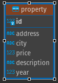
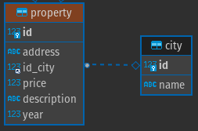
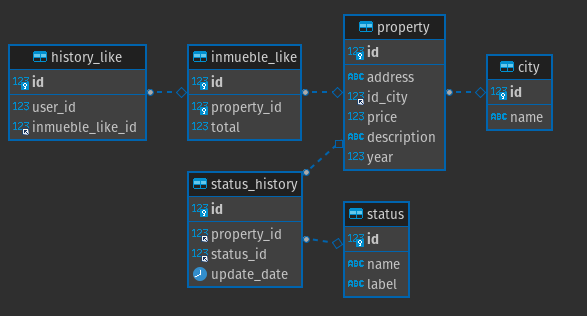

# API Inmuebles

## Tecnologias

Api sobre arquitectura Rest usando como lenguaje principal de desarrollo Python.

Librerías:
- Flask
- Mysql

## Api

Descripción de los micro-servicios desarrollados

### Servicio de consulta

**Port:5000**

**EndPoint:**

| Method | path | params | description |
| :------: | :------: | :---- | :--- |
| GET    | /api/v1/inmueble?year=2011&status=3&city=bogota | Query Params:   year:int   status:int    city:str | Listado de inmuebles en la base de datos aplicando filtros  |
| GET    | /api/v1/status | | Listado de los status disponibles para filtrar |

***Propuestas de diseño API***

Documento de prueba técnica: Instrucción N°6:

*6. En el primer requerimiento, crear un archivo JSON con los datos que esperas que
lleguen del front con los filtros solicitados por el usuario.*

Propuesta:

- Manejar method GET, esto con la finalidad de mejorar la experiencia de usuario de cara al front y poder desde el front mostrar al usuario en la url que filtros aplica, para en caso de querer compartir un enlace con un inmueble ya filtrado, este pueda conservar ese filtro. 

Adicionar EndPoint status:

Propuesta:

- Se agrega un EndPoint de listado de status para que desde el front se pueda enviar el id del status a filtrar. 

***Propuestas de diseño DB***

Normalizar tabla "property":

Diseño actual de la tabla.

Propuesta:

- Se propone normalizar la tabla extrayendo el campo "city" en otra tabla y asi evitar duplicidad de datos. 

Diseño propuesto de la tabla.

### Servicio de "Me Gusta"

Modelo DB, se propone un modelo normalizado que corresponde a la siguiente imagen:

Tablas:

- history_like: historial de likes dados por un usuario a un inmueble
- inmueble_like: likes dados a un inmueble
- property: lista de inmuebles
- city: listado de ciudades
- status: listado de status
- status_history: historial de estados de un inmuebles

Código SQL: [sql](scheme.sql)

## Despliegue

Iniciar el servidor.

**Variable de entorno**

MYSQL_DATABASE_USER= 
MYSQL_DATABASE_PASSWORD= 
MYSQL_DATABASE_HOST= 
MYSQL_DATABASE_PORT= 
MYSQL_DATABASE_SCHEMA= 
FLASK_APP=src/app.py 
FLASK_ENV=production 

**Docker Compose:**

Ajuste los parámetros de mysql en las variable de entorno dentro del archivo **docker-compose.yml**

**Build and Run**: docker-compose up -d

**Docker:**

Build : docker build -t api:v1 .

Run : `
docker run -e MYSQL_DATABASE_USER=${} \
-e MYSQL_DATABASE_PASSWORD=${} \
-e MYSQL_DATABASE_HOST=${} \
-e MYSQL_DATABASE_PORT=${} \
-e MYSQL_DATABASE_SCHEMA=${} -p 8182:5000 api:v1`

**Desarrollo:**

Install Task: [Task](https://taskfile.dev/#/)

Run
: task run

